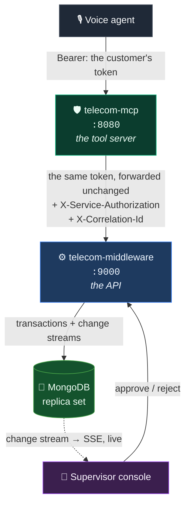

<div align="center">

# Telecom Agentic AI Support

**A voice agent that can answer a telecom customer's questions and raise requests on their behalf —
and cannot move money, change a contract, or read someone else's account.**

Not because it was told not to. Because eight authorization stages, two independent services
and a hash-chained audit trail make it impossible, and there are 1,023 tests that prove it.

<br>

[](https://github.com/arshad98333/telecom-ai-gateway/actions/workflows/ci.yml)
[](https://github.com/arshad98333/telecom-ai-gateway/actions/workflows/mongo.yml)
[](#quality-bar)
[](#quality-bar)
[](LICENSE)

[](https://www.python.org/)
[](https://docs.astral.sh/uv/)
[](https://docs.astral.sh/ruff/)
[](https://mypy-lang.org/)
[](https://modelcontextprotocol.io/)
[](https://fastapi.tiangolo.com/)
[](https://www.mongodb.com/)
[](https://auth0.com/)
[](https://docs.docker.com/compose/)
[](infra/auth0)

<br>

**[📖 The Guide](GUIDE.md)** · **[🧭 Decisions](docs/decisions/)** · **[🤝 Contributing](CONTRIBUTING.md)** · **[📋 The brief](docs/brief/)**

</div>

---

## ⚡ Run it

```bash
git clone https://github.com/arshad98333/telecom-ai-gateway.git
cd telecom-ai-gateway
make setup      # .env files, one shared secret, dependencies, a config check
make demo       # Mongo + both services in Docker, seeded
```

```bash
curl -s localhost:9000/readyz     # the API
curl -s localhost:8080/readyz     # the tool server
```

That is the whole setup. No database to install, no Auth0 account, no credentials — the
development defaults are a local verifier and a seeded replica set in Docker. `make setup`
is safe to re-run and never touches an existing `.env`.

> **Prerequisites:** [uv](https://docs.astral.sh/uv/getting-started/installation/), Docker, and `make`. Nothing else — uv fetches Python itself.

<br>

<div align="center">

### 👉 **Everything else lives in [`GUIDE.md`](GUIDE.md)** 👈

*One file, in the order you need it: run it → understand it → change it → test it →
connect a real database and a real Auth0 tenant → ship it → what to do when you are paged.*

</div>

---

## 🏗 How it fits together



Three properties do the work, and all three are deliberate:

| | |
|---|---|
| 🎫 **One token, verified twice** | The tool server never mints a token for the customer — it forwards the one it was given, and the middleware verifies it again. Both hops must agree on issuer, audience, keys and claims. |
| 🕳 **The service account is powerless** | The tool server's own credential travels in a *separate* header and proves only *which service* is calling. A request carrying only that credential is refused for anything touching customer data. **A stolen service credential reads nobody's account.** |
| 🧱 **Two layers, neither trusting the other** | The tool server answers *may this agent call this tool for this customer*. The middleware answers *may this identity read or change this record*. The middleware stays safe even if the tool server is fully compromised. |

---

## 🔐 The security model, in one screen

Every tool call passes eight stages, in this order, deny by default. The first failure ends
the call and the audit record names the stage that decided it.

```
 1  tool scope        ─ is this a tool at all, and is it blocked in v1?
 2  token             ─ does it verify?
 3  tenant            ─ does it carry one?
 4  CX ID             ─ is a customer reference present where one is required?
 5  account ownership ─ may this identity touch *this* account?      ← fails closed
 6  role              ─ is the role one we know?
 7  permission        ─ does the role hold the scope this tool needs?
 8  input schema      ─ does the payload match the frozen v1 contract?
```

Tool scope runs first so an unknown or blocked tool is refused in microseconds, with no
cryptography and no backend lookup. Then guardrails run either side of the backend call —
rate limit → size and shape → unicode → injection → business rules → action budget, and on
the way back a size cap and a secret scan.

| | |
|---|---|
| 🙈 **Refusals are indistinguishable** | "Not found" answers *exactly* like "not yours". Telling them apart would be an enumeration oracle; the distinction lives in the audit trail. |
| 🔗 **Every outcome is recorded** | Accept *and* reject, in a hash-chained log. `telecom-mcp verify-audit` proves the chain is intact. |
| 🔑 **Passcodes are never stored** | Argon2id with a per-customer salt, constant-time verification, rate-limited, locked out. Never read back, never logged, never sent to a model. |
| 💷 **Money is an integer** | 64-bit minor units with the currency beside it. Never a float. |
| 🧊 **v1 approves but never executes** | `refund:approve` is enforced; the executing side stays dark until the finance reconciliation exists. |

---

## 🧪 Quality bar

| | telecom-mcp | telecom-middleware |
|---|---|---|
| Tests | **649** passing, ~5s | **374** passing + 43 against a real replica set |
| Coverage floor | **95%**, enforced in CI | **95%**, enforced in CI |
| Types | `mypy` strict | `mypy` strict |
| Lint & format | `ruff` | `ruff` |
| Dependencies | `uv.lock`, `--frozen`, audited every push | `uv.lock`, `--frozen`, audited every push |
| Offline | ✅ no database, no credentials, no network | ✅ falls back to an in-memory store |

```bash
make check       # lint + types + tests + coverage, both services — exactly what CI runs
```

CI runs that on Python 3.11 **and** 3.12, plus the e2e contract suite, gitleaks over the
whole history, bandit, both container smokes, the 43 Mongo tests against an ephemeral
replica set — and `make setup` from a clean clone, twice, so the quickstart above cannot
quietly stop being true.

A `v*.*.*` tag on `production` publishes `telecom-mcp-tools` to PyPI and GHCR, through
TestPyPI first, with a human approval before the real index —
[how to cut one](GUIDE.md#publishing-telecom-mcp-tools-to-pypi).

---

## 🗺 The map

```
├── 📖 GUIDE.md              everything, in the order you need it
├── 🛡 telecom-mcp/          the MCP tool server — 10 tools, 8 live in v1
├── ⚙️ telecom-middleware/   the API and the only writer to MongoDB
├── 🔑 infra/auth0/          the Auth0 tenant as Terraform: API, scopes, roles, login Action
├── 🔗 e2e/                  both services in one process over real HTTP, nothing stubbed
├── ☁️ testsprite/           the external suite that runs from a cloud against a deployed URL
└── 📚 docs/
    ├── decisions/          why it is the way it is — one numbered file, immutable
    └── brief/              the specifications this was built to satisfy, unedited
```

The two services are **git subtrees** with their full history — `git log -- telecom-mcp` is
still the real story of that service, and each still builds, tests and releases on its own.

---

## 🧰 Every command

| | |
|---|---|
| `make` | every target, one line each |
| `make setup` | first run: env files, one shared secret, deps, a config check |
| `make demo` / `make down` | the whole stack in Docker, seeded / stop it |
| `make dev` | the two commands to run the services on your machine |
| `make test` · `make test-fast` · `make test-mongo` | tests |
| `make check` | what CI runs |
| `make wire-auth0` | Terraform outputs into both `.env` files, correctly |
| `make testable` · `make validate` | external testing, without wasting credits |
| `make adr` | the next decision-record number |

---

<div align="center">

**MIT licensed** · Built to the standard in [`docs/production-engineering-guidebook.md`](docs/production-engineering-guidebook.md)

*Every non-obvious choice in this codebase can be traced to a written reason.*

</div>
