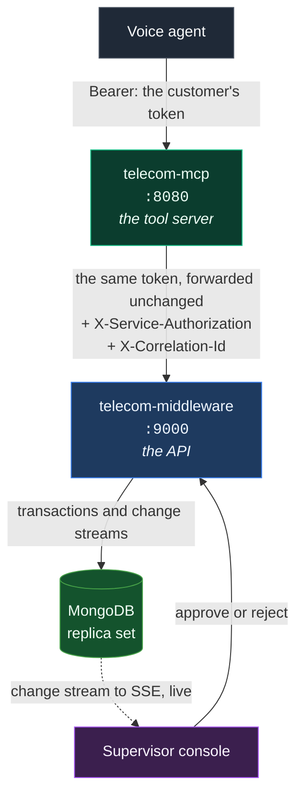

<div align="center">

# Telecom Agentic AI Support

**A voice agent that answers customer questions and raises requests on their behalf,
and that cannot move money, change a contract, or read someone else's account.**

Not because it was instructed not to. Because eight authorization stages, two
independent services and a hash-chained audit trail make it impossible, and 1,023
tests prove it on every commit.

[](https://github.com/arshad98333/telecom-ai-gateway/actions/workflows/ci.yml)
[](https://github.com/arshad98333/telecom-ai-gateway/actions/workflows/mongo.yml)
[](#quality-bar)
[](#quality-bar)
[](LICENSE)

[](https://www.python.org/)
[](https://modelcontextprotocol.io/)
[](https://fastapi.tiangolo.com/)
[](https://www.mongodb.com/)
[](https://auth0.com/)
[](infra/auth0)

[The Guide](GUIDE.md) · [Decisions](docs/decisions/) · [Contributing](CONTRIBUTING.md) · [The brief](docs/brief/)

</div>

---

## What this is

Telecom support agents spend most of their day on five questions: what is on my account,
where is my order, why is my bill this much, is there an outage, and can someone call me
back. A voice agent can answer all five. The reason most organisations do not let one
try is the sixth question: can I have a refund.

This system separates those two cases in code rather than in a prompt.

The five read questions are answered directly, scoped to the caller's own account. The
sixth creates a request that waits for a named human, records the evidence they saw, and
moves no money until they decide. Restricted actions such as plan changes and
cancellations have no executable path at all in version one.

| For the business | |
|---|---|
| Risk | An agent, or anyone who compromises it, cannot reach data or actions outside the caller's own account. The control is enforced by the API, not by the model. |
| Auditability | Every call, allowed or refused, is one record in a hash-chained log naming the identity, the decision, and which check made it. The chain is verifiable with one command. |
| Accountability | Restricted actions carry a named approver, their evidence, and a timestamp. A supervisor may not approve their own request. |
| Blast radius | The service account that connects the two halves can read nobody's account. Stealing it achieves nothing on its own. |
| Independence | Identity is Auth0; storage is MongoDB; the tenant is Terraform. No component is bespoke and none is locked in. |

---

## Run it

Prerequisites: [uv](https://docs.astral.sh/uv/getting-started/installation/), Docker, and
`make`. Nothing else, and uv fetches Python itself.

```bash
git clone https://github.com/arshad98333/telecom-ai-gateway.git
cd telecom-ai-gateway
make setup      # .env files, one shared secret, dependencies, a config check
make demo       # Mongo and both services in Docker, seeded
```

```bash
curl -s localhost:9000/readyz     # the API
curl -s localhost:8080/readyz     # the tool server
```

That is the whole setup. No database to install, no Auth0 account, no credentials. The
development defaults are a local token verifier and a seeded replica set in Docker.
`make setup` is safe to re-run and never touches an existing `.env`.

**Everything else is in [`GUIDE.md`](GUIDE.md):** run it, understand it, change it, test
it, connect a real database and a real Auth0 tenant, ship it, and what to do when you are
paged. One file, in that order.

---

## How it fits together



**`telecom-mcp`** is the gateway the voice agent calls. It decides whether this caller may
call this tool for this customer. It holds no business rules and never touches the
database.

**`telecom-middleware`** holds the rules and the data, and is the only writer to MongoDB.
It decides whether this identity may read or change this specific record.

Three properties do the work, and each is deliberate.

**One token, verified twice.** The tool server never mints a token for the customer. It
forwards the one it was given, and the middleware verifies it again. Both hops must agree
on issuer, audience, signing keys and claim names.

**The service credential is powerless.** It travels in a separate header and proves only
which *service* is calling. A request carrying only that credential is refused for anything
touching customer data.

**Neither layer trusts the other.** The middleware stays safe even if the tool server is
fully compromised, which is the property that matters when the tool server is the part
holding a language model's output.

---

## The security model

Every tool call passes eight stages, in this order, denying by default. The first failure
ends the call, and the audit record names the stage that decided it.

```
 1  tool scope        is this a tool at all, and is it blocked in v1?
 2  token             does it verify?
 3  tenant            does it carry one?
 4  CX ID             is a customer reference present where one is required?
 5  account ownership may this identity touch *this* account?      (fails closed)
 6  role              is the role one we know?
 7  permission        does the role hold the scope this tool needs?
 8  input schema      does the payload match the frozen v1 contract?
```

Tool scope runs first so an unknown or blocked tool is refused in microseconds, with no
cryptography and no database lookup. Guardrails then run either side of the backend call:
rate limit, size and shape, unicode safety, injection scan, business rules, action budget,
and on the way back a size cap and a secret scan.

| | |
|---|---|
| Refusals are indistinguishable | "Not found" answers exactly like "not yours". Telling them apart would let anyone enumerate customer identifiers. The distinction lives in the audit trail. |
| Every outcome is recorded | Allowed and refused alike, in a hash-chained log. `telecom-mcp verify-audit` proves the chain is intact. |
| Passcodes are never stored | Argon2id with a per-customer salt, constant-time verification, rate limited, locked out after repeated failures. Never read back, never logged, never sent to a model. |
| Money is an integer | 64-bit minor units with the currency beside it. Never a float. |
| Version one approves but never executes | `refund:approve` is enforced. The executing side stays dark until the finance reconciliation exists. |

---

## Quality bar

| | telecom-mcp | telecom-middleware |
|---|---|---|
| Tests | 649 passing, about 5 seconds | 374 passing, plus 43 against a real replica set |
| Coverage floor | 95%, enforced in CI | 95%, enforced in CI |
| Types | mypy strict | mypy strict |
| Lint and format | ruff | ruff |
| Dependencies | `uv.lock`, installed frozen, audited every push | `uv.lock`, installed frozen, audited every push |
| Runs offline | Yes. No database, no credentials, no network | Yes, on an in-memory store |

```bash
make check       # lint, types, tests, coverage, both services. Exactly what CI runs.
```

CI runs that on Python 3.11, 3.12 and 3.13, plus the end-to-end contract suite, gitleaks
across the whole history, bandit, both container smoke tests, the 43 MongoDB tests against
a replica set it creates and destroys, and `make setup` from a clean clone twice, so the
quickstart above cannot quietly stop being true. It runs on a push to any branch, not just
the long-lived ones — no pull request needed to get an answer.

Pushing `production` publishes signed GHCR images for `telecom-mcp-tools` and
`telecom-middleware`. Production should deploy those images by digest, not rebuild them.
[How to operate that path](GUIDE.md#deploying).

---

## The map

```
GUIDE.md              everything, in the order you need it
telecom-mcp/          the MCP tool server. Ten tools, eight live in v1
telecom-middleware/   the API, and the only writer to MongoDB
telecom-mcp-client/   a reference/ops MCP client for telecom-mcp: library + small CLI
infra/auth0/          the Auth0 tenant as Terraform: API, scopes, roles, login Action
e2e/                  both services in one process over real HTTP, nothing stubbed
testsprite/           the external suite, run from a cloud against a deployed URL
docs/
  decisions/          why it is the way it is. One numbered file each, immutable
  brief/              the specifications this was built to satisfy, unedited
```

The two services are git subtrees carrying their full history, so `git log -- telecom-mcp`
is still the real story of that service, and each still builds, tests and releases on its
own.

## Commands

| | |
|---|---|
| `make` | every target, one line each |
| `make setup` | first run: env files, one shared secret, dependencies, a config check |
| `make demo` and `make down` | the whole stack in Docker, seeded, and stopping it |
| `make dev` | the two commands to run the services on your machine |
| `make test`, `make test-fast`, `make test-mongo` | tests |
| `make check` | what CI runs |
| `make wire-auth0` | Terraform outputs into both `.env` files, correctly |
| `make testable`, `make validate` | external testing, without wasting credits |
| `make adr` | the next decision-record number |

---

<div align="center">

MIT licensed. Built to the standard in
[`docs/production-engineering-guidebook.md`](docs/production-engineering-guidebook.md).

Every non-obvious choice in this codebase can be traced to a written reason.

</div>
