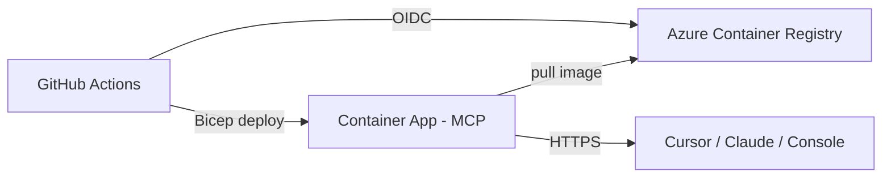

# Deploy to Azure Container Apps (end-to-end)

Deploy **telecom-mcp** to **Azure Container Apps** in UAE (or any region). No Auth0, no Key Vault, no middleware required — the fake in-memory backend serves demo data and auth is disabled.

**Live staging (UAE North)**

| | |
|--|--|
| Health | https://telecom-mcp-staging.calmfield-7654c7b3.uaenorth.azurecontainerapps.io/healthz |
| Ready | https://telecom-mcp-staging.calmfield-7654c7b3.uaenorth.azurecontainerapps.io/readyz |
| MCP | https://telecom-mcp-staging.calmfield-7654c7b3.uaenorth.azurecontainerapps.io/mcp/ |

Full endpoint table: [REFERENCE.md](REFERENCE.md).

## Architecture



## What you need

| Tool | Purpose |
|------|---------|
| [Azure CLI](https://learn.microsoft.com/cli/azure/install-azure-cli) | Bootstrap + deploy |
| GitHub repo admin | Environment variables + OIDC (optional CD) |

---

## Part 1 — Local test

| Terminal | Command | Port |
|----------|---------|------|
| 1 | `.\scripts\dev.ps1 run-mcp` | 8080 |
| 2 | `.\scripts\dev.ps1 run-middleware` | 9000 (optional) |
| 3 | `.\scripts\dev.ps1 console-dev` | 5173 (optional UI) |
| 4 | `.\scripts\dev.ps1 client-demo` | end-to-end test |

Do **not** run `Activate.ps1`. Use `deactivate` if you see `(telecom-mcp-tools)` in the prompt.

---

## Part 2 — One-time Azure bootstrap

```powershell
az login --tenant <your-tenant-id>
az account set --subscription "<your-subscription-id>"

.\scripts\azure-bootstrap.ps1 -NonInteractive
```

Default region is **UAE North** (`uaenorth`). For Abu Dhabi:

```powershell
.\scripts\azure-bootstrap.ps1 -Location uaecentral -NonInteractive
```

This creates:

- `rg-telecom-shared` — Container Registry
- `rg-telecom-staging` — Container App (after deploy)

---

## Part 3 — Deploy

```powershell
.\scripts\azure-deploy.ps1
```

Builds the image in ACR (cloud build, no local Docker), deploys Bicep, waits for `/readyz`.

**MCP URL after deploy:** `https://<app-fqdn>/mcp/` — current staging FQDN is in [REFERENCE.md](REFERENCE.md).

No bearer token required — `TELECOM_MCP_AUTH_DISABLED=true` is set in the Container App.

---

## Part 4 — GitHub OIDC (optional CD)

Push to the **`staging`** branch to trigger `.github/workflows/cd-azure-staging.yml`.

GitHub Environment **staging** variables:

| Variable | Example |
|----------|---------|
| `AZURE_CLIENT_ID` | App registration client ID |
| `AZURE_TENANT_ID` | Azure AD tenant ID |
| `AZURE_SUBSCRIPTION_ID` | Subscription GUID |
| `REGISTRY_NAME` | From bootstrap output |
| `REGISTRY_SERVER` | `xxx.azurecr.io` |
| `REGISTRY_RESOURCE_ID` | Full ARM id of ACR |
| `RESOURCE_GROUP` | `rg-telecom-staging` |

---

## Troubleshooting

| Symptom | Fix |
|---------|-----|
| `InvalidResourceGroupLocation` | RG exists in another region — delete empty RGs or use `-Location` matching existing |
| `ActivationFailed` on Container App | Redeploy with latest code (`auth_disabled` startup fix) |
| Middleware **unreachable** in console | Start `.\scripts\dev.ps1 run-middleware` (optional locally) |
| `client-demo` connection failed | Run `.\scripts\dev.ps1 run-mcp` first |

More detail: `telecom-mcp/infra/azure/README.md`
